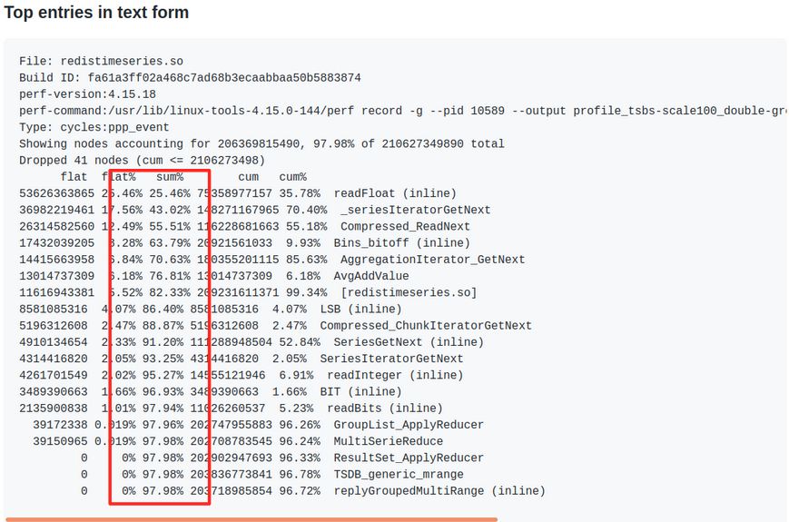
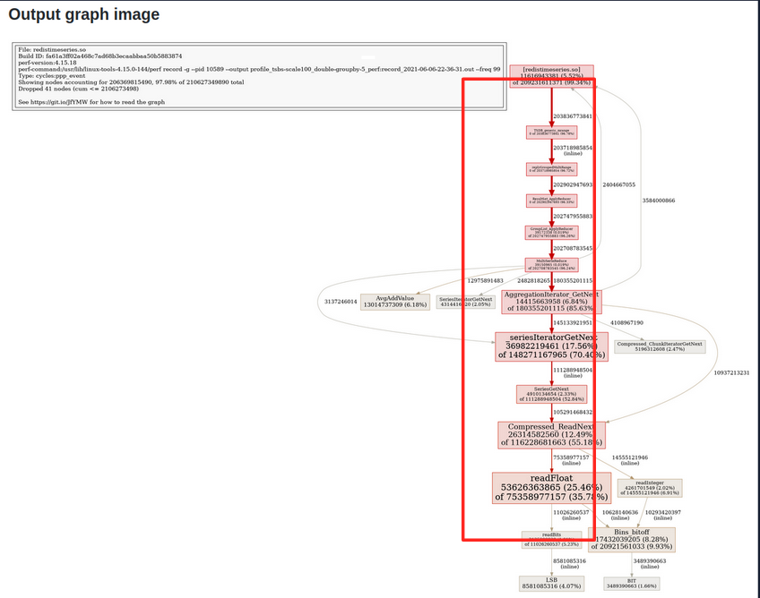
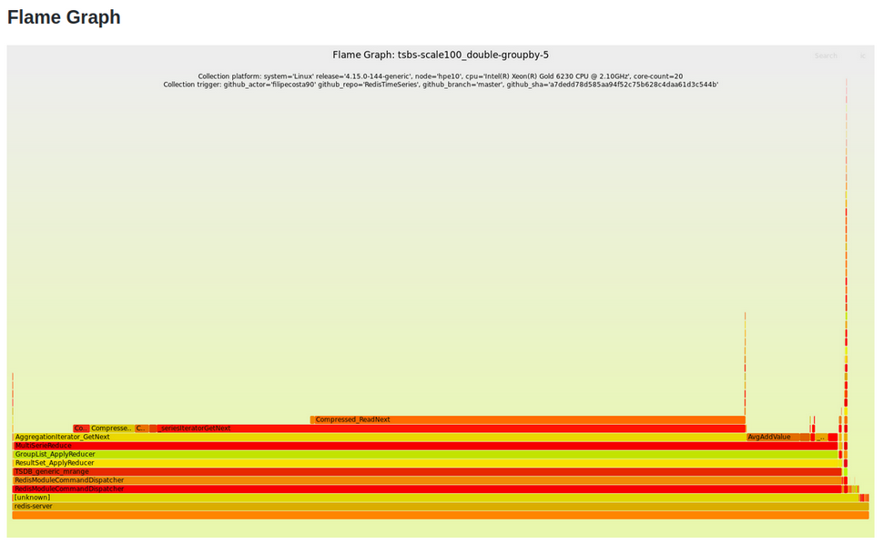

# Context

The automated benchmark definitions provides a framework for evaluating and comparing feature branches and catching regressions prior letting them into the master branch.

To be able to run local benchmarks you need `redisbench_admin>=0.1.64` [[tool repo for full details](https://github.com/RedisLabsModules/redisbench-admin)] and the benchmark tool specified on each configuration file . You can install redisbench-admin via PyPi as any other package. 
```
pip3 install redisbench_admin>=0.1.64
```

**Note:** to be able to run remote benchmarks triggered from your machine you need `terraform`.

Bellow, we dive deeper into the benchmark definition file.

# Benchmark definition

Each benchmark requires a benchmark definition yaml file to present on the current directory. 
A benchmark definition will then consist of:

- optional db configuration (`dbconfig`) with the proper dataset definition. If no db config is passed then no dataset is loaded during the system setup. You can specify both local ( path to rdb ) and remote rdb files ( example: ` "https://s3.amazonaws.com/benchmarks.redislabs/redistimeseries/tsbs/datasets/devops/functional/scale-100-redistimeseries_data.rdb"`. As soon as you run the benchmark one on your machine the remote URL is translated to a local path `./datasets/<filename>` within the benchmarks folder. **Please do not push large RDB files to git!!!.**

- mandatory client configuration (`clientconfig`) specifing the parameters to pass to the benchmark tool tool. The properties allowed here are: `tool`, `min-tool-version`, `tool_source`, `parameters`. If you don't have the required tools and the `tool_source` property is specified then the benchmark client will be downloaded once to a local path `./binaries/<tool>`. 

- optional ci remote definition (`remote`), with the proper terraform deployment configurations definition. The properties allowed here are `type` and `setup`. Both properties are used to find the proper benchmark specification folder within [RedisLabsModules/testing-infrastructure](https://github.com/RedisLabsModules/testing-infrastructure). As an example, if you specify ` - type: oss-standalone` and `- setup: redistimeseries-m5` the used terraform setup will be described by the setup at [`testing-infrastructure/tree/terraform/oss-standalone-redistimeseries-m5`](https://github.com/RedisLabsModules/testing-infrastructure/tree/master/terraform/oss-standalone-redistimeseries-m5)

- optional KPIs definition (`kpis`), specifying the target upper or lower bounds for each relevant performance metric. If specified the KPIs definitions constraints the tests passing/failing. 

- optional metric exporters definition ( `exporter`: currently only `redistimeseries`), specifying which metrics to parse after each benchmark run and push to remote stores.

Sample benchmark definition:
```yml
version: 0.2
name: "json_get_sub_doc_pass_100_json"
description: "JSON.GET pass-100 sub_doc.sclr || {Full document: pass-100.json} https://oss.redislabs.com/redisjson/performance/"
remote:
 - type: oss-standalone
 - setup: redisearch-m5d
dbconfig:
  - dataset: "https://s3.amazonaws.com/benchmarks.redislabs/redisjson/performance.docs/performance.docs.rdb"
clientconfig:
  - tool: redis-benchmark
  - min-tool-version: "6.2.0"
  - parameters:
    - clients: 16
    - requests: 2000000
    - threads: 2
    - pipeline: 1
    - command: 'JSON.GET pass-100 sub_doc.sclr'
exporter:
  redistimeseries:
    break_by:
      - version
      - commit
    timemetric: "$.StartTime"
    metrics:
      - "$.Tests.Overall.rps"
      - "$.Tests.Overall.avg_latency_ms"
      - "$.Tests.Overall.p50_latency_ms"
      - "$.Tests.Overall.p95_latency_ms"
      - "$.Tests.Overall.p99_latency_ms"
      - "$.Tests.Overall.max_latency_ms"
      - "$.Tests.Overall.min_latency_ms"

```

# Running benchmarks

The benchmark automation currently allows running benchmarks in various environments:

- completely locally, if the framework is supported on the local system.

- on AWS, distributing the tasks to multiple EC2 instances as defined on each benchmark specification. To run a benchmark on AWS you additionally need to have a configured AWS account. The application is using the boto3 Python package to exchange files through S3 and create EC2 instances. Triggering of this type of benchmarks can be done from a local machine or via CI on each push to the repo. The results visualization utilities and credentials should have been provide to each team member.

## Run benchmarks locally 

To run a benchmark locally call the `make benchmark` rule.
The `redisbench-admin` tool will detect if all requirements are set and if not will download the required benchmark utilities. 

## Run benchmarks remotely on steady stable VMs with sustained performance

To run a benchmark remotely call  `make benchmark REMOTE=1`. 

Some considerations:
- To run a benchmark on AWS you additionally need to have a configured AWS account. You can easily configure it by having the `AWS_ACCESS_KEY_ID`, `AWS_DEFAULT_REGION`, `AWS_SECRET_ACCESS_KEY` variables set.
- You are required to have EC2 instances private key used to connect to the created EC2 instances set via the `EC2_PRIVATE_PEM` environment variable. 
- The git sha, git actor, git org, git repo, and git branch information are required to properly deploy the required EC2 instances. By default that information will be automatically retrieved and can be override by passing the corresponding arguments. 
- Apart from relying on a configured AWS account, the remote benchmarks require terraform to be installed on your local system. Within `./remote/install_deps.sh` you find automation to easily install terraform on linux systems.
- Optionally, at the end of each remote benchmark you push the results json file to the `ci.benchmarks.redislabs` S3 bucket. The pushed results will have a public read ACL. 
- Optionally, at the end of each remote benchmark you can chose the export the key metrics of the benchmark definition to a remote storage like RedisTimeSeries. To do so, you will need the following env variables defined (`PERFORMANCE_RTS_AUTH`, `PERFORMANCE_RTS_HOST`, `PERFORMANCE_RTS_PORT`) or to pass the corresponding arguments.
- By default all benchmark definitions will be run.
- Each benchmark definition will spawn one or multiple EC2 instances as defined on each benchmark specification 
a standalone redis-server, copy the dataset and module files to the DB VM and make usage of the tool to run the query variations. 
- After each benchmark the defined KPIs limits are checked and will influence the exit code of the runner script. Even if we fail a benchmark variation, all other benchmark definitions are run.
- At the end of each benchmark an output json file is stored with this benchmarks folder and will be named like `<start time>-<deployment type>-<git org>-<git repo>-<git branch>-<test name>-<git sha>.json`
- In the case of a uncaught exception after we've deployed the environment the benchmark script will always try to teardown the created environment. 

# Comparing feature branches

You can use the data stored in redistimeseries of different branches to portray a differential analysis between them.
To be able to fetch the RedisTimeseries data, you need to pass either the `--redistimeseries_host,--redistimeseries_port,--redistimeseries_auth,--redistimeseries_user` 
or the equivalent `PERFORMANCE_RTS_HOST,PERFORMANCE_RTS_PORT,PERFORMANCE_RTS_AUTH,PERFORMANCE_RTS_USER`. 
**To have them, you should ask the performance team for the read-only access keys.**

Depending on the metric type ( example of latency / throughput ) the improvement is checked either via `higher-better` 
mode or `lower-better` mode. 

By default, the metric used is `Tests.Overall.rps` and the metric mode is `higher-better`. 
You can change the metric and metric mode via `--metric_name` and `--metric_mode` parameters.

**Important Note:** The current differential analysis focus only on the last datapoint of result of each branch 
( meaning this can and will be improved in the future to take into account multi-datapoints per branch ).

By default, the tool checks for the last week datapoints, and uses the most recent one per branch.
You can control the time-range of the comparison using `--from_timestamp` and `--to_timestamp` arguments.

Bellow, you can find an example comparing RedisJSON 1.0 vs master branch:

**Command:**
```
TRIGGERING_ENV=circleci redisbench-admin compare \
    --baseline-branch 1.0 --comparison-branch master \
    --github_repo RedisJSON --github_org RedisJSON \
    --redistimeseries_host ${REDISTIMESERIES_HOST} \
    --redistimeseries_port ${REDISTIMESERIES_PORT} \
    --redistimeseries_pass ${REDISTIMESERIES_PASS} \
    --redistimeseries_user ${REDISTIMESERIES_USER}
```

**Output:**
```
WARNING:root:Unable to fill git vars. caught the following error: 
Effective log level set to INFO
INFO:root:Using: redisbench-admin 0.4.7
2021-08-12 12:01:40,213 INFO Using: redisbench-admin 0.4.7
INFO:root:Checking connection to RedisTimeSeries with user: (....), host: (....), port: (....)
WARNING:root:Based on test-cases set (key=ci.benchmarks.redislabs/circleci/RedisJSON/RedisJSON:testcases) we have 35 distinct benchmarks. 
2021-08-12 12:01:40,613 WARNING Based on test-cases set (key=ci.benchmarks.redislabs/circleci/RedisJSON/RedisJSON:testcases) we have 35 distinct benchmarks. 
INFO:root:Printing differential analysis between branches
2021-08-12 12:01:47,591 INFO Printing differential analysis between branches
# Comparison between 1.0 and master for metric: Tests.Overall.rps
|                           Test Case                            |Baseline value|Comparison Value|% change (higher-better)|
|----------------------------------------------------------------|-------------:|----------------|-----------------------:|
|json_arrappend_geojson                                          |       77811.3|         64503.6|                 -17.102|
|json_get_ResultSet.totalResultsAvailable_jsonsl-yahoo2_json     |      145972.6|        137919.6|                  -5.517|
|json_get_[0]_jsonsl-1                                           |      142849.0|        131568.6|                  -7.897|
|json_get_[7]_jsonsl-1                                           |      139852.3|        127382.0|                  -8.917|
|json_get_[8].zero_jsonsl-1                                      |      153841.4|        137923.4|                 -10.347|
|json_get_[web-app].servlet[0][servlet-name]_json-parser-0000    |      135584.0|        117633.2|                 -13.240|
|json_get_[web-app].servlet[0]_json-parser-0000                  |       42183.1|         84735.7|                 100.876|
|json_get_[web-app].servlet_json-parser-0000                     |       31091.2|         78730.2|                 153.223|
|json_get_array_of_docs[1]_pass_100_json                         |      103084.3|        130712.1|                  26.801|
|json_get_array_of_docs[1]sclr_pass_100_json                     |      125776.7|        119751.9|                  -4.790|
|json_get_array_of_docs_pass_100_json                            |       88484.6|        125776.7|                  42.145|
|json_get_fulldoc_json-parser-0000                               |       27572.5|         81956.5|                 197.240|
|json_get_fulldoc_jsonsl-1                                       |       31632.8|         94777.7|                 199.619|
|json_get_fulldoc_jsonsl-yahoo2_json                             |        6278.8|         27770.1|                 342.286|
|json_get_fulldoc_jsonsl-yelp_json                               |        2760.9|         13879.2|                 402.715|
|json_get_fulldoc_pass_100_json                                  |       71676.4|        123450.7|                  72.233|
|json_get_key_empty                                              |      144919.1|        160266.7|                  10.590|
|json_get_message.code_jsonsl-yelp_json                          |      139848.4|        143876.6|                   2.880|
|json_get_sclr_pass_100_json                                     |      141835.9|        151506.0|                   6.818|
|json_get_sub_doc.sclr_pass_100_json                             |      135127.8|        144919.1|                   7.246|
|json_get_sub_doc_pass_100_json                                  |      109880.4|        127382.0|                  15.928|
|json_numincrby_num_1                                            |      131568.6|        133322.7|                   1.333|
|json_set_ResultSet.totalResultsAvailable_1_jsonsl-yahoo2_json   |      135124.2|        119039.1|                 -11.904|
|json_set_[0]foo_jsonsl-1                                        |      134221.0|        124217.4|                  -7.453|
|json_set_[web-app].servlet[0][servlet-name]_bar_json-parser-0000|      139852.3|         98029.6|                 -29.905|
|json_set_fulldoc_pass_100_json                                  |       72192.8|         87325.6|                  20.962|
|json_set_key_empty                                              |      143876.6|        156240.2|                   8.593|
|json_set_message.code_1_jsonsl-yelp_json                        |      141831.9|        117638.8|                 -17.058|
|json_set_num_0                                                  |      149244.8|        156240.2|                   4.687|
|json_set_sclr_1_pass_100_json                                   |      130708.7|        127382.0|                  -2.545|
|json_set_sclr_pass_100_json                                     |      141835.9|        129863.4|                  -8.441|
INFO:root:Detected a total of 7 stable tests between versions.
2021-08-12 12:01:47,683 INFO Detected a total of 7 stable tests between versions.
INFO:root:Detected a total of 16 improvements above the improvement water line (> 5.0 %%)
2021-08-12 12:01:47,683 INFO Detected a total of 16 improvements above the improvement water line (> 5.0 %%)
WARNING:root:Detected a total of 11 regressions bellow the regression water line (< -5.0 %%)
2021-08-12 12:01:47,684 WARNING Detected a total of 11 regressions bellow the regression water line (< -5.0 %%)
WARNING:root:Printing BENCHMARK env var compatible list
2021-08-12 12:01:47,684 WARNING Printing BENCHMARK env var compatible list
WARNING:root:BENCHMARK=json_arrappend_geojson.yml,json_get_ResultSet.totalResultsAvailable_jsonsl-yahoo2_json.yml,json_get_[0]_jsonsl-1.yml,json_get_[7]_jsonsl-1.yml,json_get_[8].zero_jsonsl-1.yml,json_get_[web-app].servlet[0][servlet-name]_json-parser-0000.yml,json_set_ResultSet.totalResultsAvailable_1_jsonsl-yahoo2_json.yml,json_set_[0]foo_jsonsl-1.yml,json_set_[web-app].servlet[0][servlet-name]_bar_json-parser-0000.yml,json_set_message.code_1_jsonsl-yelp_json.yml,json_set_sclr_pass_100_json.yml
2021-08-12 12:01:47,684 WARNING BENCHMARK=json_arrappend_geojson.yml,json_get_ResultSet.totalResultsAvailable_jsonsl-yahoo2_json.yml,json_get_[0]_jsonsl-1.yml,json_get_[7]_jsonsl-1.yml,json_get_[8].zero_jsonsl-1.yml,json_get_[web-app].servlet[0][servlet-name]_json-parser-0000.yml,json_set_ResultSet.totalResultsAvailable_1_jsonsl-yahoo2_json.yml,json_set_[0]foo_jsonsl-1.yml,json_set_[web-app].servlet[0][servlet-name]_bar_json-parser-0000.yml,json_set_message.code_1_jsonsl-yelp_json.yml,json_set_sclr_pass_100_json.yml
```

# Attaching profiling tools/probers ( perf (a.k.a. perf_events), bpf tooling, vtune ) while running local benchmarks

**Note:** This part of the guide is only valid for Linux based machines, 
and requires at least perf( and ideally pprof + perf_to_profile + graphviz ). 

As soon we enable bpf tooling automation this will be valid for darwin based systems as well ( MacOs ), **so sit tight!**

While running benchmarks locally you attach profilers ( currently only related on on-cpu time ) to understand exactly what are the functions that that more cpu cycles to complete.
Currently, the benchmark automation supports two profilers:
- perf perf (a.k.a. perf_events), enabled by default and with the profiler key: `perf:record`
- Intel (R) Vtune (TM) (`vtune`) with the profiler key: `vtune`

## Trigger a profile
To trigger a profile while running a benchmark you just need to add `PROFILE=1` to the previous env variables.

Here's an example within RedisTimeSeries project:
```
make benchmark PROFILE=1 BENCHMARK=tsbs-scale100_single-groupby-1-1-1.yml
```

Depending on the used profiler you will get:
- 1) Table of Top CPU entries in text form for the profiled process(es)
  


- 2) Call graph identifying the top hotspots 
  


- 3) FlameGraph – convert profiling data to a flamegraph




If you run the benchmark automation without specifying a benchmark ( example : `make benchmark PROFILE=1` )
the automation will trigger all benchmarks and consequently profile each individual one. 

At the end, you should have an artifact table like the following:

```bash
# Profiler artifacts
|       Test Case        | Profiler  |                                                     Artifact                                                      |                                                                                     Local file                                                                                      |s3 link|
|------------------------|-----------|-------------------------------------------------------------------------------------------------------------------|-------------------------------------------------------------------------------------------------------------------------------------------------------------------------------------|-------|
|tsbs-scale100_high-cpu-1|perf:record|Flame Graph (primary 1 of 1)                                                                                       |/home/fco/redislabs/RedisTimeSeries/tests/benchmarks/profile_oss-standalone__primary-1-of-1__tsbs-scale100_high-cpu-1_perf:record_2021-07-14-10-04-38.out.flamegraph.svg             |       |
|tsbs-scale100_high-cpu-1|perf:record|perf output (primary 1 of 1)                                                                                       |/home/fco/redislabs/RedisTimeSeries/tests/benchmarks/profile_oss-standalone__primary-1-of-1__tsbs-scale100_high-cpu-1_perf:record_2021-07-14-10-04-38.out                            |       |
|tsbs-scale100_high-cpu-1|perf:record|perf report top self-cpu (primary 1 of 1)                                                                          |/home/fco/redislabs/RedisTimeSeries/tests/benchmarks/profile_oss-standalone__primary-1-of-1__tsbs-scale100_high-cpu-1_perf:record_2021-07-14-10-04-38.out.perf-report.top-cpu.txt    |       |
|tsbs-scale100_high-cpu-1|perf:record|perf report top self-cpu (dso=/home/fco/redislabs/RedisTimeSeries/bin/linux-x64-release-profile/redistimeseries.so)|/home/fco/redislabs/RedisTimeSeries/tests/benchmarks/profile_oss-standalone__primary-1-of-1__tsbs-scale100_high-cpu-1_perf:record_2021-07-14-10-04-38.out.perf-report.top-cpu.dso.txt|       |
|tsbs-scale100_high-cpu-1|perf:record|Top entries in text form                                                                                           |/home/fco/redislabs/RedisTimeSeries/tests/benchmarks/profile_oss-standalone__primary-1-of-1__tsbs-scale100_high-cpu-1_perf:record_2021-07-14-10-04-38.out.pprof.txt                  |       |
|tsbs-scale100_high-cpu-1|perf:record|Output graph image in PNG format                                                                                   |/home/fco/redislabs/RedisTimeSeries/tests/benchmarks/profile_oss-standalone__primary-1-of-1__tsbs-scale100_high-cpu-1_perf:record_2021-07-14-10-04-38.out.pprof.png                  |       |
```

##

### Further notes on using perf (a.k.a. perf_events) in non-root user

If running in non-root user please confirm that you have:
 - **access to Kernel address maps**.

    Check if `0` ( disabled ) appears from the output of `cat /proc/sys/kernel/kptr_restrict`
   
    If not then fix via: `sudo sh -c " echo 0 > /proc/sys/kernel/kptr_restrict"`
 

 - **permission to collect stats**.
    
    Check if `-1` appears from the output of `cat /proc/sys/kernel/perf_event_paranoid`
    
    If not then fix via: `sudo sh -c 'echo -1 > /proc/sys/kernel/perf_event_paranoid'`

### Further note on profiling in Rust

Due to Rust symbol (de)mangling still being unstable we're not able to properly 
demangle symbols if we use perf default's `fp` (frame-pointer based walking on the stack to understand for a sample).

Therefore, when profiling Rust you need to set the env variable `PERF_CALLGRAPH_MODE` to `dwarf`. Further notes on the different perf 
`call-graph` modes [here](https://stackoverflow.com/a/57432063). 

Here's an example of RedisJson profile run:
```bash
make build benchmark PROFILE=1 BENCHMARK=json_get_array_of_docs[1]sclr_pass_100_json.yml PERF_CALLGRAPH_MODE=dwarf
```
