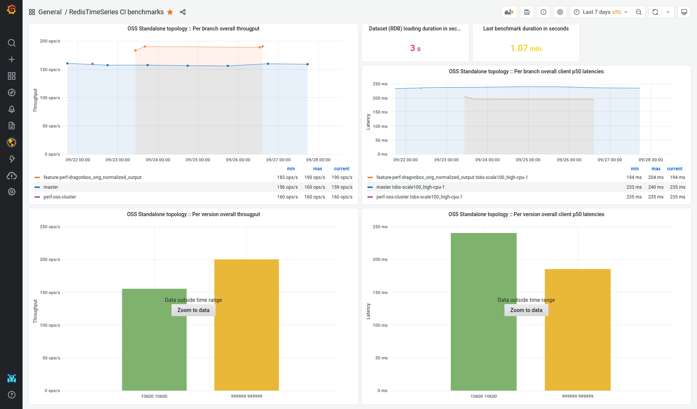
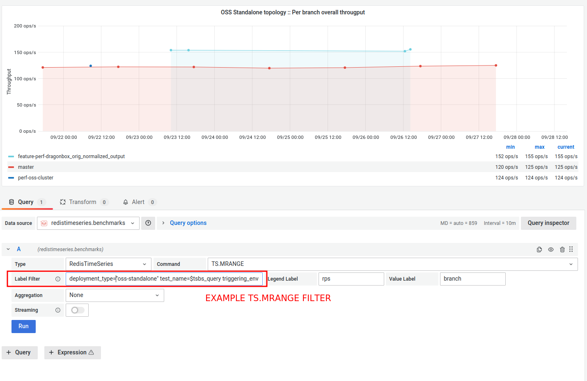

# [redisbench-admin export](https://github.com/RedisLabsModules/redisbench-admin)

Redis benchmark exporter can help you exporting performance results based on several formats input (CSV, JSON) and
pushing them to data sinks in a time-series format. 

Ultimately it provides a framework for evaluating and comparing feature branches and catching regressions prior letting them into the master branch,
as shown on the bellow sample dashboard produced from exported data via [redisbench-admin export](https://github.com/RedisLabsModules/redisbench-admin).



Current supported benchmark tools to export data from:

- [redis-benchmark](https://github.com/redis/redis)
- [memtier_benchmark](https://github.com/RedisLabs/memtier_benchmark)
- [redis-benchmark-go](https://github.com/filipecosta90/redis-benchmark-go)
- [YCSB](https://github.com/RediSearch/YCSB)
- [tsbs](https://github.com/RedisTimeSeries/tsbs)
- [redisgraph-benchmark-go](https://github.com/RedisGraph/redisgraph-benchmark-go)
- [ftsb_redisearch](https://github.com/RediSearch/ftsb)
- [SOON][aibench](https://github.com/RedisAI/aibench)

## Installation

Installation is done using pip, the package installer for Python, in the following manner:

```bash
python3 -m pip install redisbench-admin>=0.5.5
```

## Required minimum arguments 

In order to run the exporter the following arguments are the minimum required:

- `--benchmark-result-file`: The produced results file from the benchmark tool. For example, in memtier_benchmark 
  you can use the `--json-out-file` to produce a results JSON file that we will use to produce the time-series data.
- `--exporter-spec-file`: An YAML metric exporters definition, specifying which metrics to parse and push to remote
  stores. We will provide an example of memtier_benchmark exporter definition YAML bellow.
- `--deployment-name`: The deployment name, used as part of of the naming of the timeseries and as part of the timeseries
  tags.
- `--deployment-type`: The deployment type (one of `enterprise,enterprise-oss-cluster,oss-standalone,oss-cluster`). Used
  as part of of the naming of the timeseries and as part of the timeseries tags.
- `--test-name`: The test name, used as part of of the naming of the timeseries and as part of the timeseries tags.


The full list of arguments can be checked bellow: 

```bash
redisbench-admin export --help
usage: redisbench-admin [-h]

Required arguments:
  --benchmark-result-file BENCHMARK_RESULT_FILE
                        benchmark results file to read results from. (default:
                        None)
  --exporter-spec-file EXPORTER_SPEC_FILE
                        Exporter definition file, containing info of the
                        metrics to extract (default: None)
  --deployment-name DEPLOYMENT_NAME
                        Deployment name (default: None)
  --deployment-type DEPLOYMENT_TYPE
                        Deployment Type (default: None)
  --test-name TEST_NAME
                        Test name (default: None)
                        
Optional arguments:
  -h, --help            show this help message and exit
  --version             print version and exit (default: False)
  --deployment-version DEPLOYMENT_VERSION
                        semver of the deployed setup. If None then only per
                        branch/ref time-series are created (default: None)
  --local-dir LOCAL_DIR
                        local dir to use as storage (default: ./)
  --logname LOGNAME     logname to write the logs to (default: None)
  --github_actor [GITHUB_ACTOR]
  --github_repo GITHUB_REPO
  --github_org GITHUB_ORG
  --github_branch [GITHUB_BRANCH]
  --triggering_env TRIGGERING_ENV
  --results-format RESULTS_FORMAT
                        results format of the the benchmark results files to
                        read results from ( either json, redis-benchmark-txt )
                        (default: json)
  --extra-tags EXTRA_TAGS
                        comma separated extra tags in the format of
                        key1=value,key2=value,... (default: )
  --redistimeseries_host REDISTIMESERIES_HOST
  --redistimeseries_port REDISTIMESERIES_PORT
  --redistimeseries_pass REDISTIMESERIES_PASS
  --redistimeseries_user REDISTIMESERIES_USER
```

# Exporter definition

To be able to parse and push the data properly to the data-sinks, each benchmark results type requires an exporter 
definition yaml file.
 
An exporter definition will then consist of:

- metric exporters definition ( `exporter`: currently only `redistimeseries`), specifying which metrics to parse 
  after each benchmark run and push to remote stores.
  
Bellow you can find a sample exporter definition for `memtier_benchmark`.

## Sample exporter definition for memtier_benchmark > v1.3.0:
```yml
version: 0.5
exporter:
  redistimeseries:
    timemetric: "$.'ALL STATS'.Runtime.'Start time'"
    metrics:
      - "$.'ALL STATS'.Totals.'Ops/sec'"
      - "$.'ALL STATS'.Totals.'Percentile Latencies'.'p50.00'"
      - "$.'ALL STATS'.Totals.'Percentile Latencies'.'p99.00'"
      - "$.'ALL STATS'.Totals.'Percentile Latencies'.'p99.00'"
      - "$.'ALL STATS'.Totals.'Average Latency'"
      - "$.'ALL STATS'.Totals.'Min Latency'"
      - "$.'ALL STATS'.Totals.'Max Latency'"
```

## Sample exporter definition for memtier_benchmark <= v1.3.0:
```yml
version: 0.5
exporter:
  redistimeseries:
    timemetric: "$.'ALL STATS'.Runtime.'Start time'"
    metrics:
      - "$.'BEST RUN RESULTS'.Totals.'Ops/sec'"
```

# Exporting results

## Exporting memtier_benchmark results

Assuming you've ran memtier_benchmark with the option `--json-out-file <results file>` at the end of the benchmark
you will end with a results json. 
For the purpose of this sample let's consider we've ran memtier as follow:

```bash
memtier_benchmark --json-out-file results.json
```

After the benchmark ends we will have the `results.json` file.
Together with the "Sample exporter definition for memtier_benchmark" YAML above, that you can download at 
[exporter-memtier-metrics.yml](https://github.com/RedisLabsModules/redisbench-admin/blob/master/docs/exporter-memtier-metrics.yml)
you can push the memtier results to redistimeseries via:

**Command:**
```bash
redisbench-admin export \
    --benchmark-result-file results.json \
    --exporter-spec-file exporter-memtier-metrics.yml \
    --deployment-type "oss-standalone" --deployment-name "1-node-c5.4xlarge" \
    --github_org Redis --github_repo Redis --github_branch "feature-branch" \
    --deployment-version 6.2 \
    --test-name "test-default-memtier" \
    --redistimeseries_host ${REDISTIMESERIES_HOST} \
    --redistimeseries_port ${REDISTIMESERIES_PORT} \
    --redistimeseries_pass ${REDISTIMESERIES_PASS}
```

**RedisTimeSeries expected keys**:

In a general prespective you should have 3 types of keys/time-series:
- General time-series: 
  - One time serie keeping track of the total success exports/tests for the org/project. 
    
     Named as follow:
     - `ci.benchmarks.redislabs/<triggering environment>/<github org>/<github repo>:total_success`
    
  - One SET containing the project different test cases.
     Named as follow:
      - `ci.benchmarks.redislabs/<triggering environment>/<github org>/<github repo>:testcases`


- Branch related time-series: (this will only be generated you pass the branch info to the exporter).
  
  For each of the metrics you've provided on the exporter definition you should expect at a per-branch timeseries, named in the format:
  - `ci.benchmarks.redislabs/by.branch/<triggering environment>/<github org>/<github repo>/<test name>/<deployment type>/<deployment name>/<branch name>/<metric name>`

- Version related time-series: (this will only be generated you pass the version info to the exporter)
  
  For each of the metrics you've provided on the exporter definition you should expect at a per-version timeseries, named in the format:
  - `ci.benchmarks.redislabs/by.version/<triggering environment>/<github org>/<github repo>/<test name>/<deployment type>/<deployment name>/<version name>/<metric name>`


Here's the expected keys generated by the export command above:

```bash
127.0.0.1:6379> keys *
### general time-series
  ) "ci.benchmarks.redislabs/ci/Redis/Redis:total_success"
  ) "ci.benchmarks.redislabs/ci/Redis/Redis:testcases"
### branch related keys/time-series
  ) "ci.benchmarks.redislabs/ci/Redis/Redis:branches"
  ) "ci.benchmarks.redislabs/by.branch/ci/Redis/Redis/test-default-memtier/oss-standalone/1-node-c5.4xlarge/feature-branch/ALL_STATS_Totals_Max_Latency"
  ) "ci.benchmarks.redislabs/by.branch/ci/Redis/Redis/test-default-memtier/oss-standalone/1-node-c5.4xlarge/feature-branch/ALL_STATS_Totals_Average_Latency"
  ) "ci.benchmarks.redislabs/by.branch/ci/Redis/Redis/test-default-memtier/oss-standalone/1-node-c5.4xlarge/feature-branch/ALL_STATS_Totals_Percentile_Latencies_p50_00"
  ) "ci.benchmarks.redislabs/by.branch/ci/Redis/Redis/test-default-memtier/oss-standalone/1-node-c5.4xlarge/feature-branch/ALL_STATS_Totals_Min_Latency"
  ) "ci.benchmarks.redislabs/by.branch/ci/Redis/Redis/test-default-memtier/oss-standalone/1-node-c5.4xlarge/feature-branch/ALL_STATS_Totals_Percentile_Latencies_p99_00"
  ) "ci.benchmarks.redislabs/by.branch/ci/Redis/Redis/test-default-memtier/oss-standalone/1-node-c5.4xlarge/feature-branch/ALL_STATS_Totals_Ops_sec"
### version related keys/time-series
  ) "ci.benchmarks.redislabs/ci/Redis/Redis:versions"
  ) "ci.benchmarks.redislabs/by.version/ci/Redis/Redis/test-default-memtier/oss-standalone/1-node-c5.4xlarge/6.2/ALL_STATS_Totals_Average_Latency"
  ) "ci.benchmarks.redislabs/by.version/ci/Redis/Redis/test-default-memtier/oss-standalone/1-node-c5.4xlarge/6.2/ALL_STATS_Totals_Ops_sec"
  ) "ci.benchmarks.redislabs/by.version/ci/Redis/Redis/test-default-memtier/oss-standalone/1-node-c5.4xlarge/6.2/ALL_STATS_Totals_Percentile_Latencies_p50_00"
  ) "ci.benchmarks.redislabs/by.version/ci/Redis/Redis/test-default-memtier/oss-standalone/1-node-c5.4xlarge/6.2/ALL_STATS_Totals_Min_Latency"
  ) "ci.benchmarks.redislabs/by.version/ci/Redis/Redis/test-default-memtier/oss-standalone/1-node-c5.4xlarge/6.2/ALL_STATS_Totals_Percentile_Latencies_p99_00"
  ) "ci.benchmarks.redislabs/by.version/ci/Redis/Redis/test-default-memtier/oss-standalone/1-node-c5.4xlarge/6.2/ALL_STATS_Totals_Max_Latency"
```

## Visualizing the exported metrics in Grafana

In order to visualize the exported metrics you need access to a Grafana with the Redis Datasource plugin.

Request access to the https://benchmarksrediscom.grafana.net to the Redis Ltd Performance Group and you should have 
those requirements  setup for you.

After that is taken care you can start visualizing/aggregating the data into multiple views.
The following RedisTimeseries `TS.MRANGE` is an example of an per branch overall througput visualization based 
uppon the `ALL_STATS_Totals_Ops_sec` metric.



The label filter you see marked in red on the image is:

```
deployment_type="oss-standalone" test_name=$tsbs_query triggering_env=circleci  branch!= metric=ALL_STATS_Totals_Ops_sec github_repo=RedisTimeSeries github_org=RedisTimeSeries
```
